# The Vet Visit: Gemini concept set for the three-zone past

Painted reference images for the 30 x 52 three-act past (waiting room, ward, operating theatre). They exist so the
next session can hand-draw the real pixel art and lay out the room. **They are references only.** Nothing here goes
into `Resources/`, nothing gets pixelized into a sprite, and the row-string art stays hand-drawn (the user compared
Gemini sprites with hand-drawn ones and chose hand-drawn).

- Generator: `tools/gemini_past_concepts.py` (`--dry-run`, `--only NAME[,NAME]`, `--force`, `--candidates N`,
  `--model ID`, `--jobs N`, `--sheet`).
- Model: `gemini-3-pro-image` for every file (the newest "pro" image model the API listed on 2026-09-14; the
  `modelVersion` the API echoed back is stored in each `.json` sidecar). Output size 2K (2048 px on the long side),
  the largest `imageConfig.imageSize` the model accepts. The image-generation skill's CLI has no size flag and cannot
  attach a reference image, so the script posts to the REST endpoint directly with the boss card
  (`reference/gemini/vet_bosscard_raw.png`) inlined for every image that shows the Vet and the old win picture inlined
  for the victory beat.
- Files: `reference/gemini/past_concepts/<name>.png` plus `<name>.json` (model, ratio, reference, timestamp, final
  prompt). `_c2` is the second candidate of a level map, `_r1` is a round-1 reject kept for comparison.
- Contact sheet: `docs/past-concepts-sheet.png` (rebuild with `--sheet`).

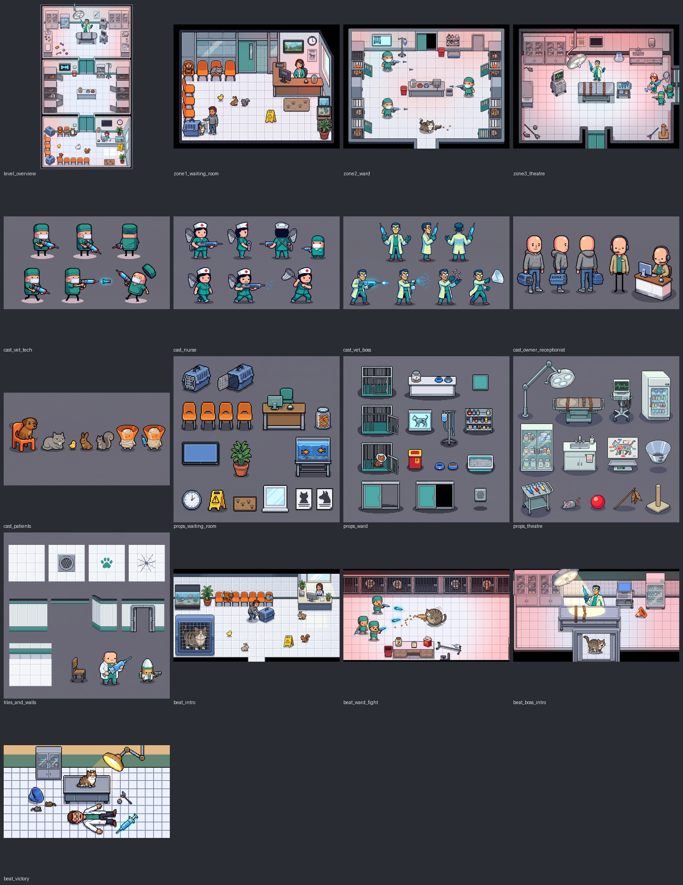

## Reading the images: what to take, what to ignore (applies to all of them)

Take: the zone layout and prop positions, prop silhouettes and proportions relative to a tile, the palette
(all images were prompted with the hex values from `tools/vetpixel.py`), the character silhouettes and one-accent
colour per enemy, the pose ideas on the cast sheets.

Ignore: any residual perspective (Gemini likes to bend the east wall), gradient lighting and soft glows (the game's
Primerdyne tint is a flat ambient colour, not a spotlight), any lettering that slipped through, the "pixel" grain
itself (it is painted noise, not a real pixel grid, so never trace it), duplicated props (several maps drew two
carriers), and character details that contradict the specs (listed per image below).

## Level maps

### 1. `level_overview.png` (9:16, 2 candidates, chosen: the one now named `level_overview.png`)

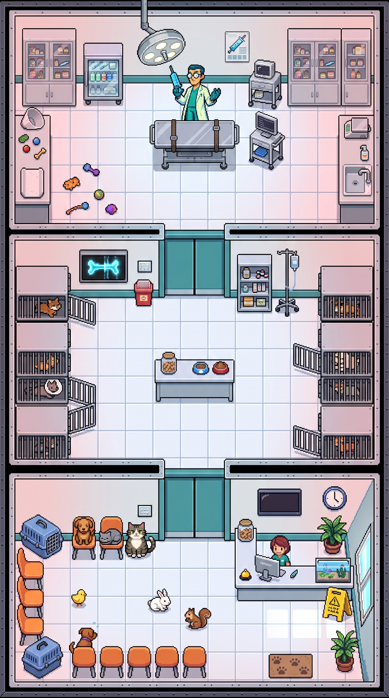

Intended use: the master layout for `tools/clinic_room.py`. The ASCII draft at the end of this page was read off it.

Why this candidate: the chunky steel wall border and the two divider walls are clearer, the doors sit exactly on the
centre line, kennels are drawn as stacked double units (a good prop unit), and the floor is cleaner white. The other
candidate (`level_overview_c2.png`) has a stronger pink ward tint and Pluto standing beside the carrier, which is
closer to the brief, but its walls are thinner and the ward is a gradient wash.

Take: the three zone heights (roughly 13 / 18 / 18 tiles), chairs along the west wall plus a row along the south
wall, desk against the zone's east side, kennels along both long walls, nurse station centred, table at the top
centre with the Vet behind it, cabinets across the theatre's north wall, toys in the theatre corners.
Ignore: two carriers (there is one), the Receptionist's face, the north wall face height (it is 2 tiles in game).

### 2. `zone1_waiting_room.png` (4:3, 2 candidates, chosen: `zone1_waiting_room.png`)

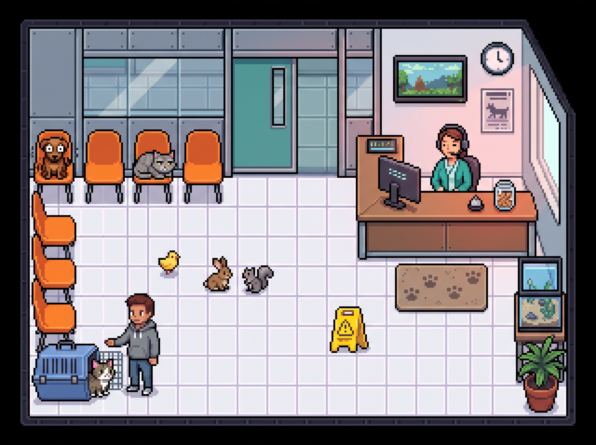

Why: `zone1_waiting_room_c2.png` is a corner view with real perspective on both side walls (rejected). The chosen one
is flat apart from a bevelled south-east corner, which is actually a vanilla room-shape idea worth keeping.

Take: chairs in an L along the west and north-west, desk on the east with the Receptionist behind it, window and
posters on the east wall, mat in front of the desk, fish tank and plant in the south-east, wet-floor sign in the
open floor, Owner crouched by the carrier at the south-west with Pluto inside, Rex and Grandma Cat on the north row.
Ignore: the wall is about 5 tiles tall (draw 2), the door is off-centre (it must be at x 14..15), the glass office
wall behind the chairs (there is a wall TV there instead).

### 3. `zone2_ward.png` (4:3, 2 candidates, chosen: `zone2_ward.png`)

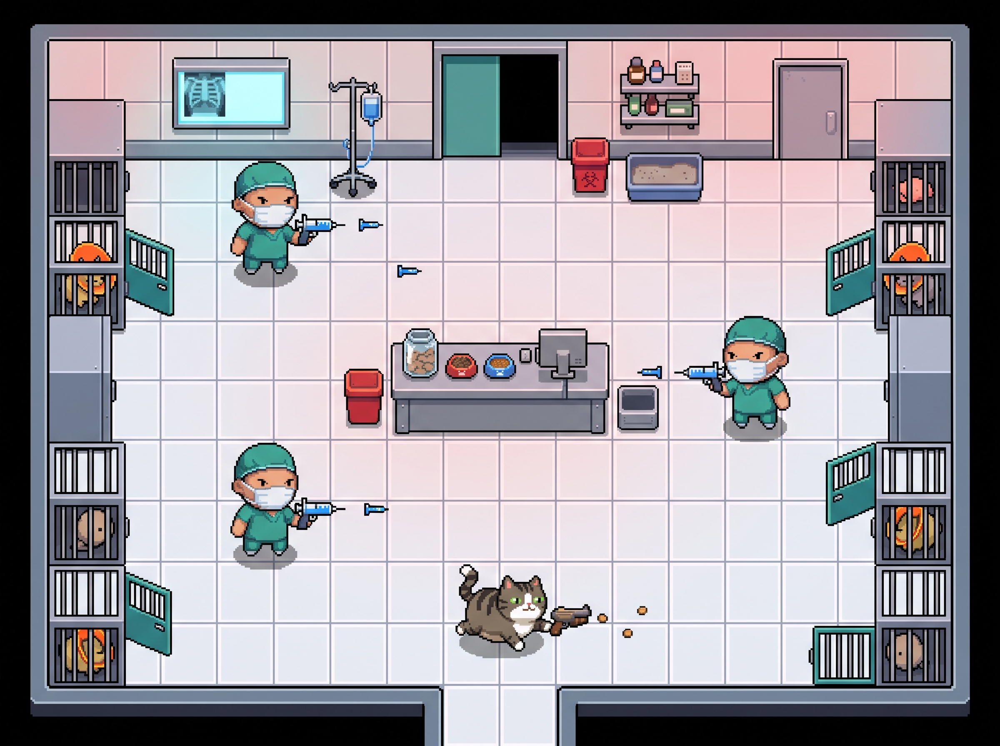

Why: `zone2_ward_c2.png` only drew two Techs and a U-shaped station; the chosen one has three Techs mid-attack,
proper door gaps top and bottom, side doors, and every prop on the list (X-ray box, IV stand, medicine shelf, sharps
bin, litter box).
Take: kennel columns of three on each long wall with alternating open doors, station in the dead centre with jar and
bowls, X-ray and IV in the north-west, shelf, sharps bin and litter box in the north-east, plain side doors.
Ignore: Pluto's face (no white blaze in this one), the pink gradient in the corners, the second sharps bin.

### 4. `zone3_theatre.png` (4:3, 2 candidates, round 2, chosen: `zone3_theatre.png`)

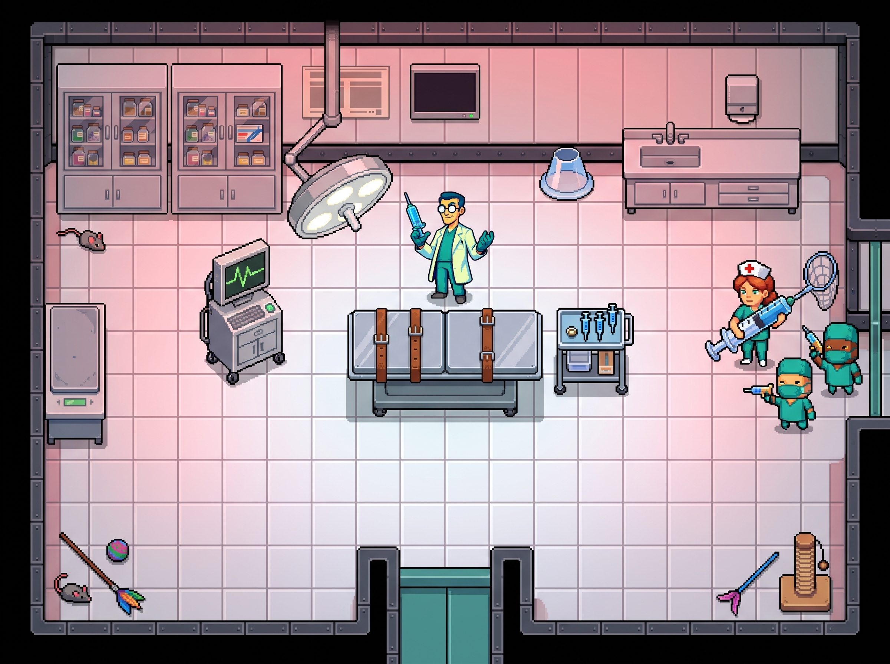

Round 2 change: round 1 (`zone3_theatre_r1.png`, `zone3_theatre_c2_r1.png`) wrote VACCINE on the fridge and CAT
ANATOMY on the poster and gave the Nurse a real shotgun. The prompt now says the fridge and poster carry no
lettering and the Nurse's weapon is a giant medical syringe. Both round-2 candidates are clean; the chosen one has
the lamp arm reaching over the table from the wall, the syringe cart beside the table, and the Nurse carrying both
syringe and net. `zone3_theatre_c2.png` is the alternative with the cabinets in a row along the north wall.
Take: open centre floor, table just above centre with the Vet behind it, monitor cart west of the table, syringe
cart east of it, cabinets and fridge in the north-west, sink and scale in the north-east, cone by the sink, toys in
the south corners, scratching post south-east, Nurse and Techs entering from the east door.
Ignore: the pink glow around the walls, the lamp's exact arm (draw it as a separate wall-mounted prop).

## Cast sheets

### 5. `cast_vet_tech.png` (16:9)

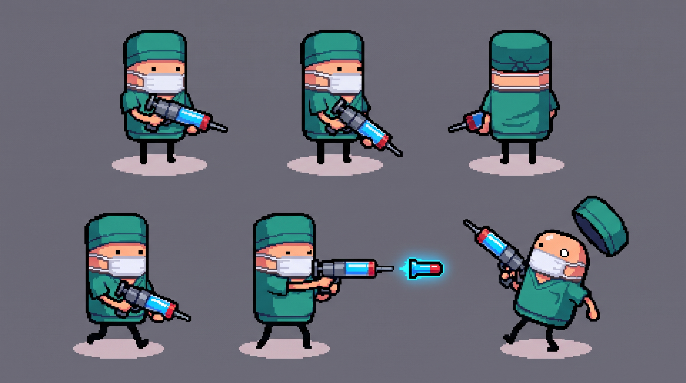

Take: the Bullet-Kin body plan (cap and head are one capsule, body is the same capsule continued), mask, stick legs,
the syringe pistol held at hip height, the walk with one leg forward, the hit pose with the cap flying off. This is
the 24x32 enemy; the body reads at that size.
Ignore: the red plunger end (use syringe liquid blue), the shading on the cap.

### 6. `cast_nurse.png` (16:9)

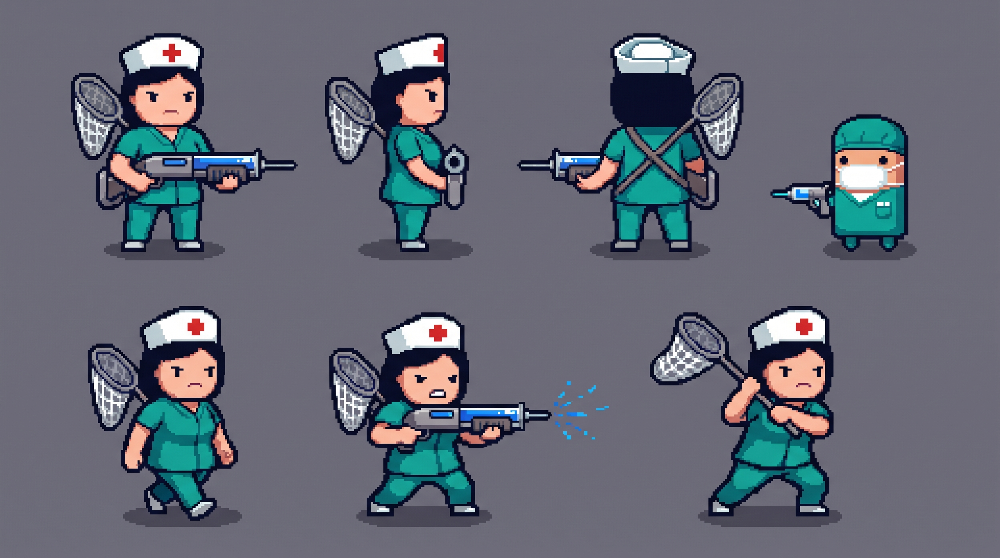

Take: twice the Tech's height with the Tech beside her for scale, the cap with a red cross, the net on the back in
all views, the pump-action pose spraying droplets, the two-handed net swing.
Ignore: the weapon is half gun half syringe here; draw it as a plain oversized syringe with a pump grip.

### 7. `cast_vet_boss.png` (16:9)

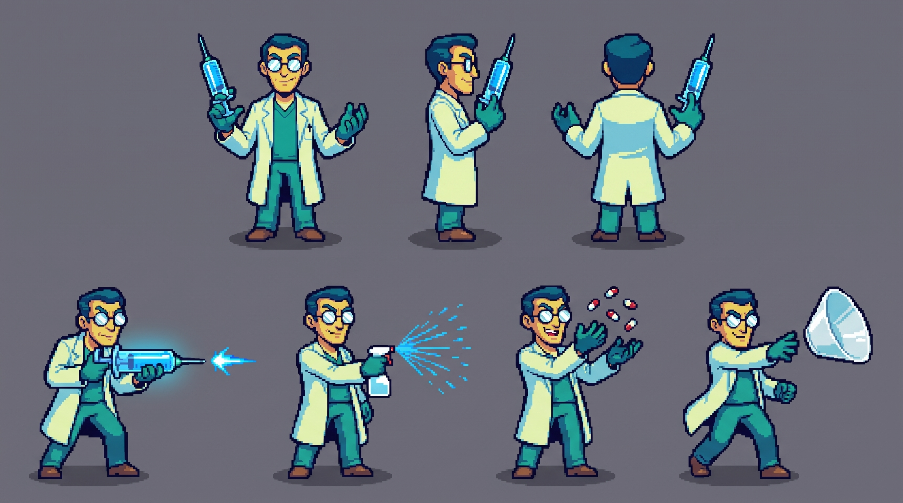

Take: the three standing views match the existing boss card and `tools/vet_poses.py` (coat, teal scrubs, gloves,
round glasses); the four tells are exactly the attacks: aimed booster shot, spray-bottle fan, pill volley, cone
throw. Use the tell silhouettes when drawing the boss animation frames.
Ignore: nothing major; the syringe is drawn as glass not the vaccine gun of 0.4.0, keep whichever the boss sprite uses.

### 8. `cast_owner_receptionist.png` (16:9)

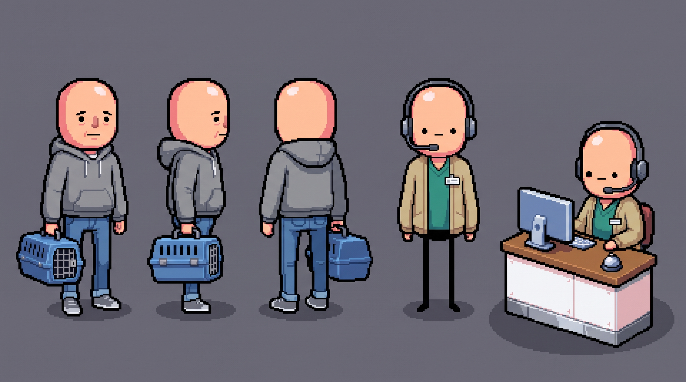

Take: the Owner's hoodie, jeans and sneakers, the carrier carried by its handle at knee height in all three views,
the Receptionist's headset and cardigan, the seated pose behind a small desk with computer and bell.
Ignore: the bald egg heads (Gemini's Bullet-Kin reading; give them hair like the Vet's pipeline), the blank name
badge.

### 9. `cast_patients.png` (16:9, round 2)

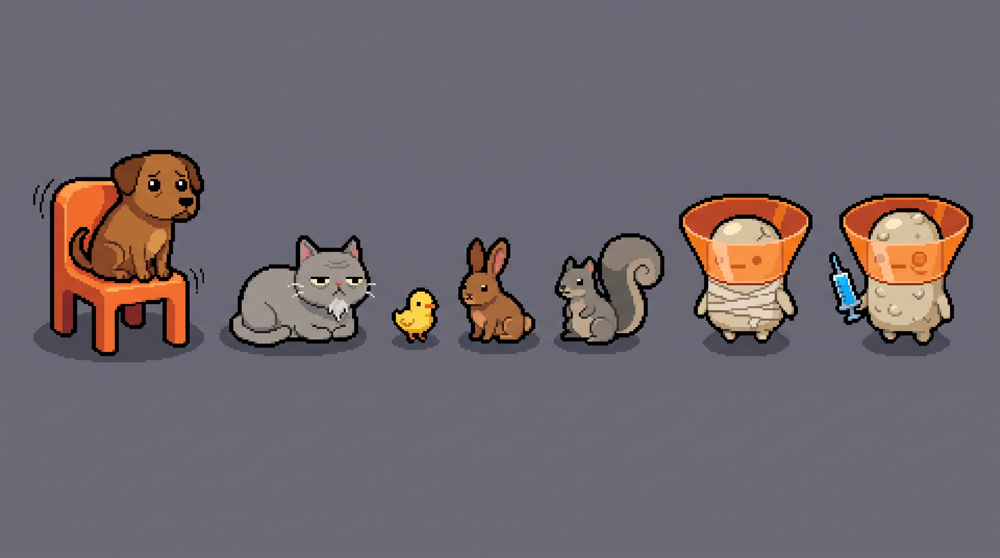

Round 2 change: round 1 (`cast_patients_r1.png`) painted a tiled clinic behind the figures; the prompt now insists
the background is one flat grey with no room. Round 1 is still worth a look for its bluer, calmer palette.
Take: Rex hunched on the chair with shake lines, Grandma Cat as a grey loaf with half-lidded eyes and a wispy chin,
the chick, rabbit and squirrel at the vanilla critter sizes, the two cone patients as lumpy bandaged Bullet-Kin
shapes (the `mutant_bullet_kin` stand-ins).
Ignore: the orange cones (the game's cone is translucent white), Rex's chair colour is right but the chair shape is
the sheet's, not the room's.

## Prop sheets

### 10. `props_waiting_room.png` (1:1)

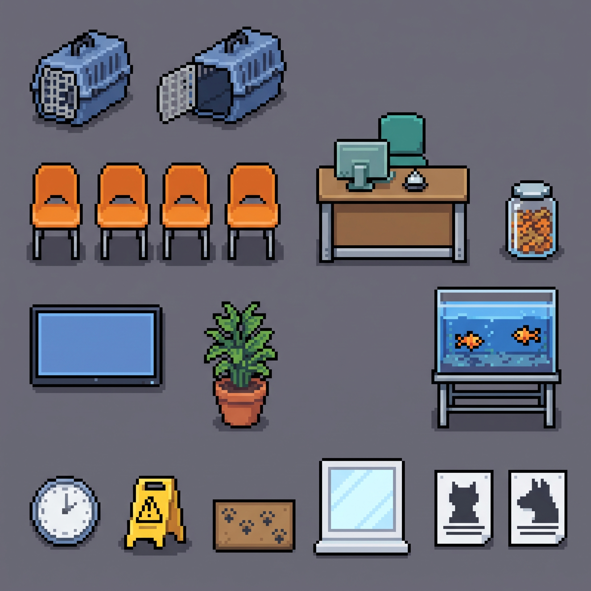

Take: carrier closed and open (the wire door swings left), the four-chair row, the desk with monitor and bell, the
treat jar, TV, plant, fish tank on a stand, clock, wet-floor sign, paw mat, window with sill, two blank posters.
Ignore: the teal office chair behind the desk (the Receptionist sprite covers it), the mat texture.

### 11. `props_ward.png` (1:1)

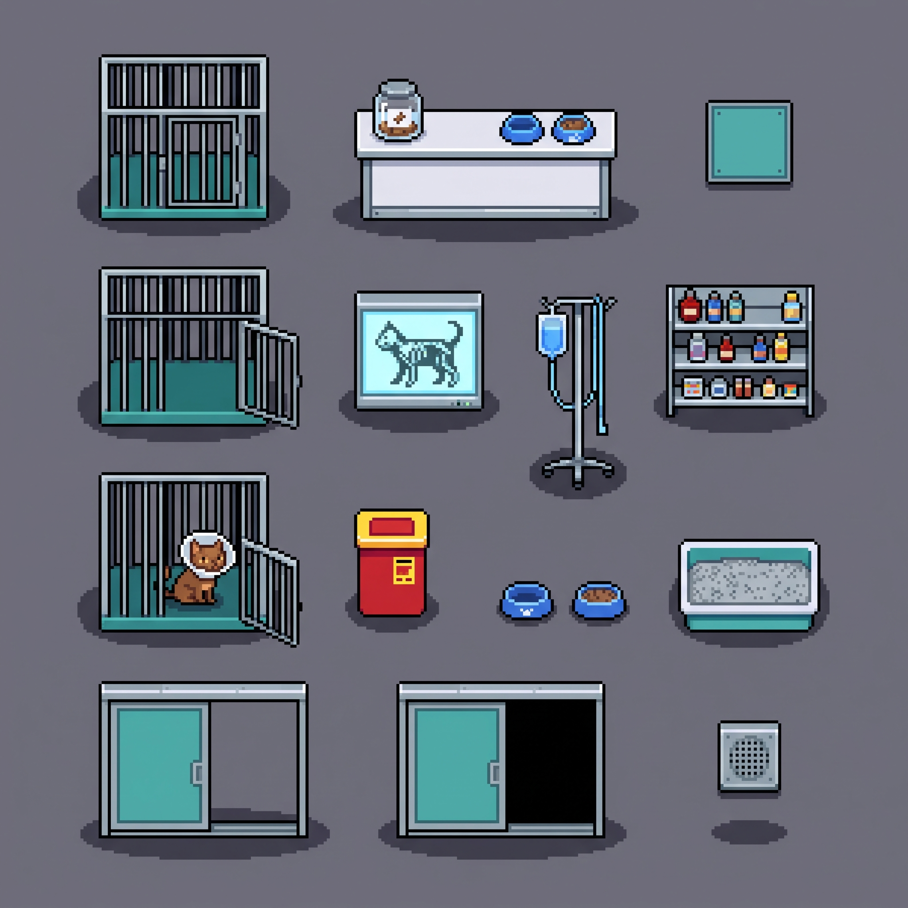

Take: the kennel in three states (closed, open, cone patient), the nurse station with jar and bowls, the blank teal
sign panel, X-ray box with a cat skeleton, IV stand, medicine shelf, sharps bin, food bowls, litter box, sliding door
closed and open (the open state shows a black gap), intercom speaker.
Ignore: the kennel floor colour (teal reads as water; use steel).

### 12. `props_theatre.png` (1:1)

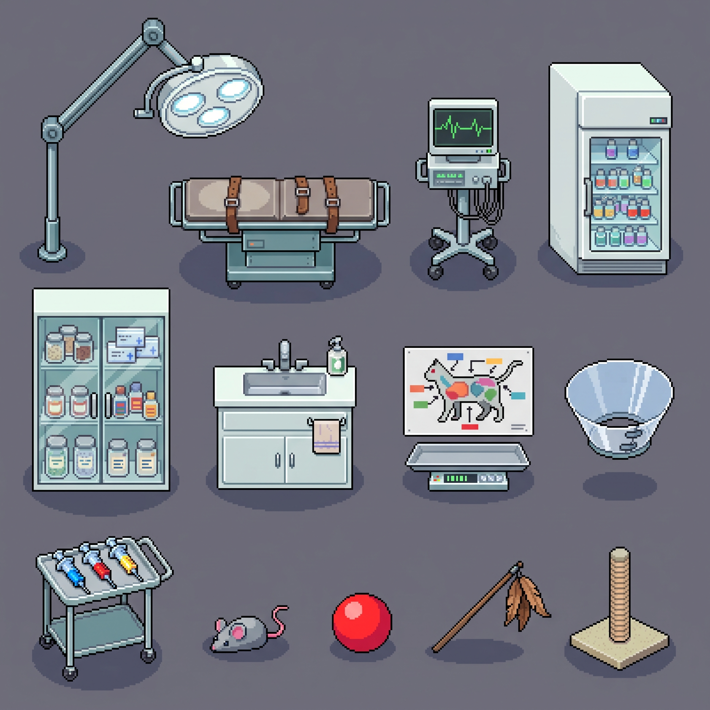

Take: the surgical lamp on a jointed arm, the strap table with three straps, monitor cart, vaccine fridge with vials,
glass cabinet, sink counter, pet scale, wordless anatomy poster (silhouette plus colour blobs), cone, syringe cart,
mouse, ball, feather wand, scratching post. The first eight replace or refine the props already in
`tools/clinic_objects.py`.
Ignore: the beige table pad (the game table is steel), the scale's digital readout.

### 13. `tiles_and_walls.png` (1:1)

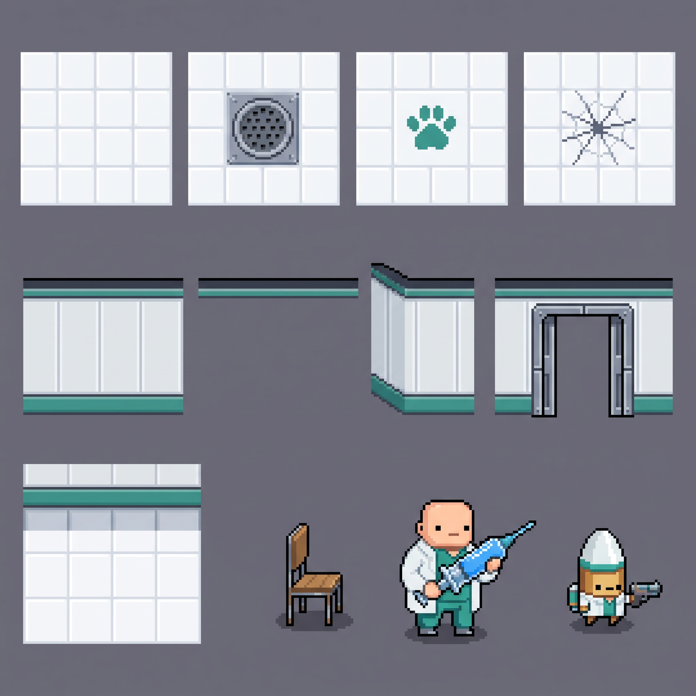

Take: the four floor variants (plain, drain, paw print, cracked), the wall face with a teal skirting and dark top
strip, the top strip alone, the outer corner, the framed door gap, the floor-to-wall shadow band.
Ignore: the three figures at the bottom (padding Gemini added), the floor grout brightness (use #DCE0E6).

## Story beats

### 14. `beat_intro.png` (16:9, round 2)

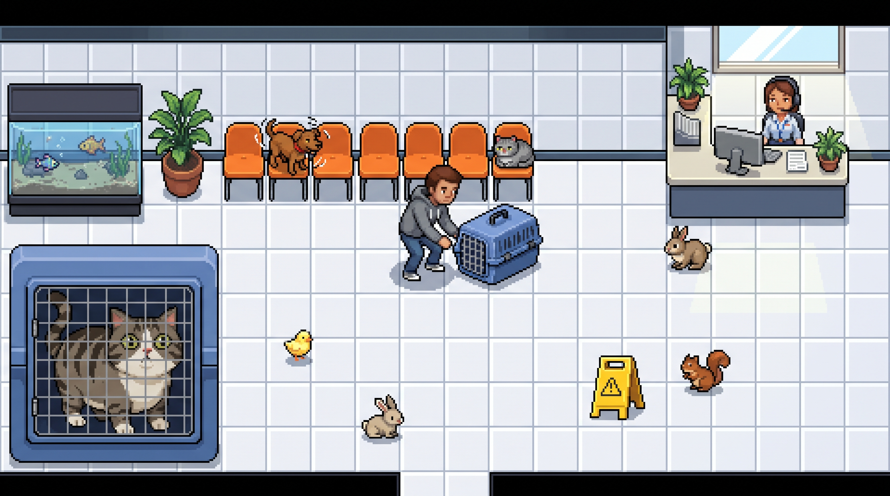

Round 2 change: round 1 (`beat_intro_r1.png`) wrote WET FLOOR on the sign and bent the east wall into perspective.
The prompt now asks for a symbol-only sign and axis-aligned walls. Round 1 has the better composition (Owner in the
middle, desk to the right); use it for staging and the round-2 file for the flat camera.
Take: the Owner bent over the carrier, Receptionist looking up from the desk, Rex shaking on the chair row.
Ignore: the second, giant carrier with Pluto in it, the reception-booth window.

### 15. `beat_ward_fight.png` (16:9)

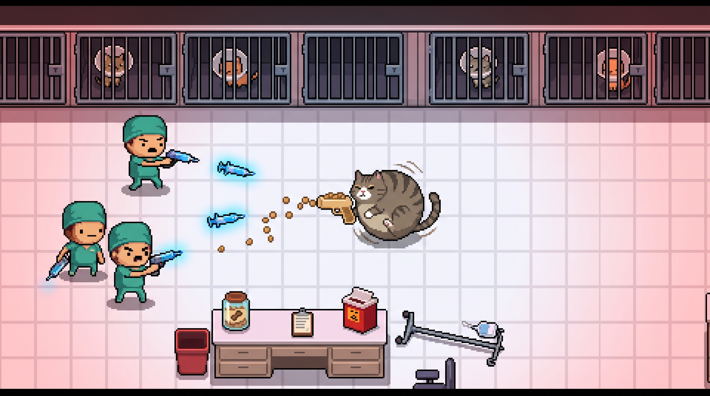

Take: Pluto as a rolling ball with motion lines and the kibble gun still pointed, the kibble stream, the syringe
darts as glowing blue capsules, the cone patients watching from the kennels, the knocked-over IV stand.
Ignore: the fat-ball Pluto proportions (fun, but the dodge roll frames use the existing roll), the station being a
wooden desk.

### 16. `beat_boss_intro.png` (16:9, round 2)

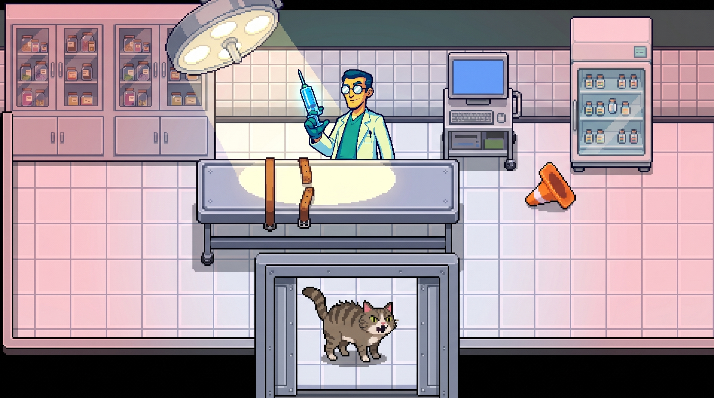

Round 2 change: round 1 (`beat_boss_intro_r1.png`) lettered the fridge; the prompt now forbids it. Round 1 has the
stronger pink Primerdyne mood and a real cone; round 2 is cleaner. Both are usable.
Take: the framing (the Vet under the lamp behind the table, Pluto hissing in the doorway at the bottom centre), the
lamp's light pool as the one place a glow is allowed, the cabinets flanking the wall.
Ignore: the orange traffic cone in round 2 (it is a cone of shame), the tilted cabinet fronts in round 1.

### 17. `beat_victory.png` (16:9, round 2)

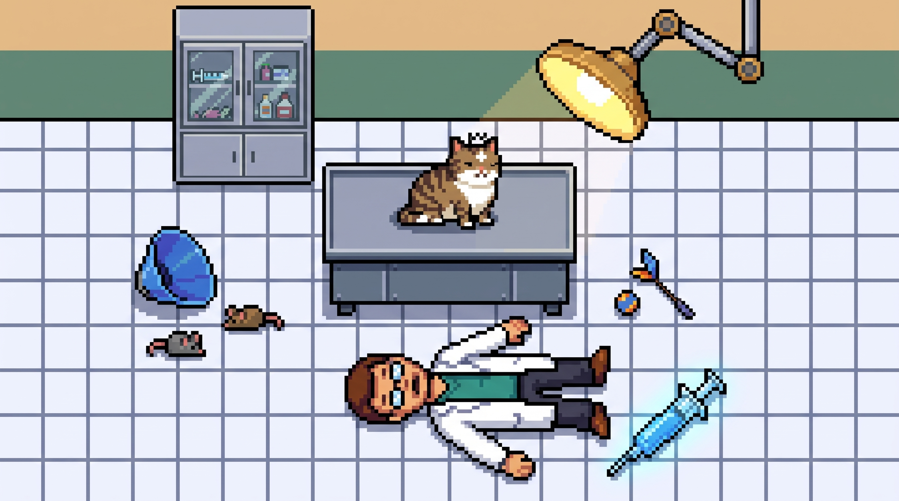

Round 2 change: round 1 (`beat_victory_r1.png`) drew the floor in vanishing-point perspective with a desk lamp; the
prompt now demands an axis-aligned floor grid, a multi-bulb surgical lamp and Pluto's white crown oval. Round 2 fixed
the floor and the crown but still drew a desk lamp and gave Pluto a tiny cap. Two rounds were the limit, so both are
kept: round 2 for the layout, round 1 for Pluto's pose and the cone kicked into the corner, and the existing
`reference/gemini/past_win_pic_raw.png` remains the canonical win picture.
Take: Pluto on the table, the Vet flat on the floor with glasses askew, the loose syringe, the toys.
Ignore: the desk lamp, the cap, the green wall band.

## Strongest images

1. `zone3_theatre.png`: a complete boss arena in one picture with every prop placed and the cast present.
2. `level_overview.png`: the whole 30 x 52 room, readable straight into a cell map.
3. `cast_vet_boss.png`: all four tells plus turnaround, consistent with the existing boss card.

## Proposed 30 x 52 zone layout (draft for `tools/clinic_room.py`)

Read off `level_overview.png` and the three zone maps, then squared to the grid. Top row first, y = 51 at the top,
game coordinates (x right, y up, cell (0,0) bottom-left) as in `clinic_room.py`. Zone heights: waiting room 13
floor rows (y 1..13), ward 18 rows (y 15..32), theatre 17 rows (y 34..50); the two divider walls are at y 14 and y
33 with the door gap at x 14..15. Side doors `d` are on the long walls. Legend after the map.

```
##############################  y=51
#GGGGFF.............A.SSS.PP.#  y=50
#GGGGFF.MM...LLLL.....SSS.PP.#  y=49
#.......MM....VV.............#  y=48
#...........TTTTTT.YY........#  y=47
#...........TTTTTT.YY........#  y=46
#............................#  y=45
#..........................C.#  y=44
#............................#  y=43
#............................d  y=42
#............................d  y=41
#............................#  y=40
#............................#  y=39
#.m..........................#  y=38
#............................#  y=37
#..b......................ss.#  y=36
#.w.......................ss.#  y=35
#............................#  y=34
##############DD##############  y=33
#....XX.EEp..........R..ll...#  y=32
#KK................I.......KK#  y=31
#KK........................KK#  y=30
#............................#  y=29
#............................#  y=28
#KK........................KK#  y=27
#KK........................KK#  y=26
#............................#  y=25
d...........NNNNNN...........d  y=24
d...........NNNNNN...........d  y=23
#KK........................KK#  y=22
#KK........................KK#  y=21
#............................#  y=20
#............................#  y=19
#KK........................KK#  y=18
#KK........................KK#  y=17
#............................#  y=16
#............................#  y=15
##############DD##############  y=14
#...tt................r.k....#  y=13
#..cxcgc...........QQQQQQQ.q.#  y=12
#..................QQQQQQQ...#  y=11
#............................#  y=10
#c................._____.....#  y=9
#c...........................#  y=8
#c.........................ff#  y=7
#c.........................ffW  y=6
#c...........................W  y=5
#..............z.............W  y=4
#BBo.........................#  y=3
#BB..........................#  y=2
#..........................q.#  y=1
##############################  y=0
```

Legend. Walls and doors: `#` wall, `.` floor, `D` zone door (sliding door prop, sealed until the zone is cleared),
`d` side door the Techs and the Nurse spawn from, `W` window (wall decoration, east wall).
Waiting room: `B` carrier (spawn beside it), `o` the Owner's intro spot, `c` plastic chair, `x` Rex on a chair, `g`
Grandma Cat on a chair, `Q` reception desk, `r` the Receptionist, `t` wall TV, `k` clock, `q` plant, `f` fish tank,
`z` wet-floor sign, `_` paw-print mat (walkable). The chick, rabbit and squirrel are ambient critters, not cells.
Ward: `K` kennel cage (2 x 2, a stacked double unit as in the overview; alternate open and closed, two with cone
patients), `N` nurse station (treat jar and the two bowls sit on it), `X` X-ray box, `E` medicine shelf, `p` PREP
sign, `I` IV stand, `R` sharps bin, `l` litter box.
Theatre: `T` exam table with straps, `V` the Vet's start cell, `L` surgical lamp (wall-mounted, decorative, above
the table), `M` monitor cart, `G` glass cabinet, `F` vaccine fridge, `A` anatomy poster (wall), `S` sink counter, `P`
pet scale, `Y` syringe tray cart, `C` cone of shame, `m` toy mouse, `b` ball, `w` feather wand, `s` scratching post.

Open questions for the layout session: whether the theatre door at y 33 should be 2 or 3 cells wide for the boss
camera, whether the kennels should be 2 x 2 blocks or 2 x 3 with a gap for the escaped-patient spawns, and whether
the waiting room needs the bevelled south-east corner from `zone1_waiting_room.png`.

## Final prompt text per image

Every prompt starts with the shared style block (camera, scale, rendering, character language, palette, mood) and
ends with the shared negative list; both are in `tools/gemini_past_concepts.py`. The full text sent for each file,
including the round-2 additions, is in that file's `.json` sidecar next to the PNG. The per-image bodies are
reproduced below.

<details><summary><code>level_overview</code> (9:16, model gemini-3-pro-image, reference reference/gemini/vet_bosscard_raw.png)</summary>

The room is a tall rectangle of white tiles with a dark chunky steel-grey wall border. The two sliding clinic doors that separate the zones sit on the room's vertical centre line, drawn as a gap in a horizontal wall segment with a steel door frame and a teal sliding door panel. Keep one consistent tile grid across the whole picture. Whole-level map of one big room 30 tiles wide and 52 tiles tall, seen entirely in one image, three zones stacked south (bottom) to north (top), separated by two horizontal wall segments each with a sliding clinic door in the centre. BOTTOM ZONE, the waiting room (about 14 tiles tall): a blue plastic cat carrier #6F8FBF by a row of orange plastic chairs along the west wall, a reception desk with a computer, a bell and a jar of treats against the north wall of the zone with the Receptionist behind it, a wall TV, a potted plant, a fish tank, a clock, a yellow wet-floor sign, a floor mat with paw prints, a window with daylight on the east wall, a trembling dog on a chair, a grey cat loaf on another chair, a chick, a rabbit and a squirrel loose on the floor. Pluto the cat standing beside the carrier for scale. Pluto is a chunky tabby-and-white cat: grey-brown taupe tabby fur #8B7A66 (light #B4A180, shadow #66524A), near-black mackerel stripes, a forehead "M" marking, a tabby mask around the eyes, a white blaze between the eyes running down to a white muzzle and chest, a small white oval on the crown surrounded by tabby, big pink ears, hazel-green eyes with slit pupils, a ringed tail. About 1.2 tiles tall, rounder than a human. MIDDLE ZONE, the ward (about 18 tiles tall): kennel cages lined along both long walls, some open and some closed, a few holding patients in cones, a nurse station in the middle with a treat jar and two cat-food bowls, an X-ray light box, a medicine shelf, an IV stand, a red sharps bin, two side doors on the east and west walls. TOP ZONE, the operating theatre (about 18 tiles tall): a big open floor as a boss arena, a large overhead surgical lamp, a steel exam table with straps in the upper middle, a monitor cart, a vaccine fridge, glass cabinets with jars and syringe boxes, a sink counter, a pet scale, a cone of shame and cat toys along the walls. The Vet matches the attached reference image exactly: tall, slightly sinister, white lab coat over teal scrubs, round glasses catching the light, short dark hair, teal gloves, one hand holding an enormous syringe of glowing blue liquid #4FA8E8. He stands behind the exam table at the very top. Every prop is a separate small sprite on the floor, walls are chunky and dark, the whole room fills the frame edge to edge.

</details>


<details><summary><code>zone1_waiting_room</code> (4:3, model gemini-3-pro-image)</summary>

The room is a tall rectangle of white tiles with a dark chunky steel-grey wall border. The two sliding clinic doors that separate the zones sit on the room's vertical centre line, drawn as a gap in a horizontal wall segment with a steel door frame and a teal sliding door panel. Keep one consistent tile grid across the whole picture. Map of the south zone only: the veterinary clinic waiting room, a rectangle about 30 tiles wide and 14 tiles tall, the north wall face two tiles tall visible at the top with a sliding clinic door in its centre. Along the west wall a row of five orange plastic chairs #F08A24 on steel legs; a blue plastic cat carrier #6F8FBF with a wire door sits on the floor beside them. Against the north wall a wood-and-steel reception desk with a computer monitor, a small desk bell and a glass jar of treats; the Receptionist, an office worker with a headset and a cardigan, sits behind it. On the east wall a window with pale daylight, a wall-mounted TV, a round clock, a poster. A potted plant in the corner, a fish tank on a stand, a yellow wet-floor sign, a rectangular floor mat with paw prints in front of the desk. Patients: Rex, a nervous brown dog with big eyes, trembling on a chair; Grandma Cat, an ancient grey cat in a loaf on the next chair with half-closed unimpressed eyes; a yellow chick, a brown rabbit and a grey squirrel loose on the floor. The Owner, a human in a grey hoodie and jeans, standing by the carrier with an arm out having just set it down. Pluto is a chunky tabby-and-white cat: grey-brown taupe tabby fur #8B7A66 (light #B4A180, shadow #66524A), near-black mackerel stripes, a forehead "M" marking, a tabby mask around the eyes, a white blaze between the eyes running down to a white muzzle and chest, a small white oval on the crown surrounded by tabby, big pink ears, hazel-green eyes with slit pupils, a ringed tail. About 1.2 tiles tall, rounder than a human. Pluto sits inside the open carrier.

</details>


<details><summary><code>zone2_ward</code> (4:3, model gemini-3-pro-image)</summary>

The room is a tall rectangle of white tiles with a dark chunky steel-grey wall border. The two sliding clinic doors that separate the zones sit on the room's vertical centre line, drawn as a gap in a horizontal wall segment with a steel door frame and a teal sliding door panel. Keep one consistent tile grid across the whole picture. Map of the middle zone only: the clinic ward, a rectangle about 30 tiles wide and 18 tiles tall, the north wall face two tiles tall visible at the top with a sliding clinic door in its centre and a second door gap in the south wall at the bottom centre. Kennel cages with steel bars line both long walls: some doors open, some closed, a few holding small patients wearing plastic cones of shame. In the middle a rectangular nurse station counter with a glass treat jar and two cat-food bowls on it. An X-ray light box glowing pale blue on the north wall, a medicine shelf with bottles, a steel IV stand with a bag, a red sharps bin, a litter box, a small teal sign panel on the wall. A plain steel side door in the east wall and one in the west wall. Three Vet Techs are mid-attack, spread across the floor, each firing a blue syringe dart from a syringe pistol. Vet Tech: a human enemy with the Bullet Kin body plan (big head, short body, stick legs), teal scrubs #3F9E8F with dark teal #2C7367 folds, a teal surgical cap, a white mask over the mouth, holding a syringe pistol (a syringe with a pistol grip, blue liquid). About 1.4 tiles tall. Pluto is a chunky tabby-and-white cat: grey-brown taupe tabby fur #8B7A66 (light #B4A180, shadow #66524A), near-black mackerel stripes, a forehead "M" marking, a tabby mask around the eyes, a white blaze between the eyes running down to a white muzzle and chest, a small white oval on the crown surrounded by tabby, big pink ears, hazel-green eyes with slit pupils, a ringed tail. About 1.2 tiles tall, rounder than a human. Pluto is near the south door dodge-rolling, a small kibble gun in his paws, with a few tan kibble pellet bullets in the air.

</details>


<details><summary><code>zone3_theatre</code> (4:3, model gemini-3-pro-image, reference reference/gemini/vet_bosscard_raw.png)</summary>

The room is a tall rectangle of white tiles with a dark chunky steel-grey wall border. The two sliding clinic doors that separate the zones sit on the room's vertical centre line, drawn as a gap in a horizontal wall segment with a steel door frame and a teal sliding door panel. Keep one consistent tile grid across the whole picture. Map of the north zone only: the operating theatre as a boss arena, a rectangle about 30 tiles wide and 18 tiles tall with a door gap in the south wall at the bottom centre. A big open white-tile floor in the middle kept empty for the fight; all props sit along the walls: a steel exam table with brown leather straps against the north wall centre with a large overhead surgical lamp on an arm above it, a monitor cart with a green heartbeat screen, a white vaccine fridge with a glass door, glass cabinets full of jars and syringe boxes, a sink counter, a pet scale, a poster of a cat anatomy diagram, a plastic cone of shame, a rolling cart with a tray of syringes, and scattered cat toys (a toy mouse, a ball, a feather wand, a small scratching post) in the corners. The Vet matches the attached reference image exactly: tall, slightly sinister, white lab coat over teal scrubs, round glasses catching the light, short dark hair, teal gloves, one hand holding an enormous syringe of glowing blue liquid #4FA8E8. He stands behind the exam table, about 2.5 tiles tall, syringe raised. The Nurse: the Vet Tech design at twice the size (about 2.8 tiles tall), a white nurse cap with a red cross, teal scrubs, a shotgun-sized syringe with a pump grip in both hands and a butterfly net on her back. The Nurse and two Vet Techs are entering through a side door in the east wall. Vet Tech: a human enemy with the Bullet Kin body plan (big head, short body, stick legs), teal scrubs #3F9E8F with dark teal #2C7367 folds, a teal surgical cap, a white mask over the mouth, holding a syringe pistol (a syringe with a pistol grip, blue liquid). About 1.4 tiles tall. The ambient light has the faint pink-red Primerdyne tint. The vaccine fridge is a plain white cabinet with a glass door and NO label or lettering on it; the anatomy poster is a cat silhouette with coloured organ blobs and NO writing; nothing in the room carries letters. The Nurse's weapon is a giant medical syringe (glass barrel with blue liquid, plunger, needle), not a gun.

</details>


<details><summary><code>cast_vet_tech</code> (16:9, model gemini-3-pro-image)</summary>

Plain flat neutral grey background #6C6C7A, no floor, no scene, no shadows on the background except each figure's small ellipse. Equal generous spacing, nothing overlapping, everything drawn at the same scale. Character reference sheet for a 2D game enemy sprite, drawn at game proportions as if 32 pixels tall then shown large. Vet Tech: a human enemy with the Bullet Kin body plan (big head, short body, stick legs), teal scrubs #3F9E8F with dark teal #2C7367 folds, a teal surgical cap, a white mask over the mouth, holding a syringe pistol (a syringe with a pistol grip, blue liquid). About 1.4 tiles tall. Top row: front view, side view and back view standing, in one line. Bottom row: a walking pose mid-stride, an attack pose aiming the syringe pistol forward with a glowing blue dart leaving it, and a hit-flinch pose leaning back with the cap flying off. Six figures total, same size, evenly spaced.

</details>


<details><summary><code>cast_nurse</code> (16:9, model gemini-3-pro-image)</summary>

Plain flat neutral grey background #6C6C7A, no floor, no scene, no shadows on the background except each figure's small ellipse. Equal generous spacing, nothing overlapping, everything drawn at the same scale. Character reference sheet for a 2D game mini-boss sprite, drawn at game proportions as if 64 pixels tall then shown large. The Nurse: the Vet Tech design at twice the size (about 2.8 tiles tall), a white nurse cap with a red cross, teal scrubs, a shotgun-sized syringe with a pump grip in both hands and a butterfly net on her back. She is stern, with a small tight mouth and tiny dot eyes. Top row: front view, side view and back view standing, in one line, with one Vet Tech at half her height standing beside the front view for scale. Vet Tech: a human enemy with the Bullet Kin body plan (big head, short body, stick legs), teal scrubs #3F9E8F with dark teal #2C7367 folds, a teal surgical cap, a white mask over the mouth, holding a syringe pistol (a syringe with a pistol grip, blue liquid). About 1.4 tiles tall. Bottom row: a walking pose, an attack pose pumping the shotgun syringe with a fan of blue droplets spraying out, and a net-throw pose swinging the butterfly net. Evenly spaced.

</details>


<details><summary><code>cast_vet_boss</code> (16:9, model gemini-3-pro-image, reference reference/gemini/vet_bosscard_raw.png)</summary>

Plain flat neutral grey background #6C6C7A, no floor, no scene, no shadows on the background except each figure's small ellipse. Equal generous spacing, nothing overlapping, everything drawn at the same scale. Character reference sheet for a 2D game boss sprite, drawn at game proportions as if 64 pixels tall then shown large. The Vet matches the attached reference image exactly: tall, slightly sinister, white lab coat over teal scrubs, round glasses catching the light, short dark hair, teal gloves, one hand holding an enormous syringe of glowing blue liquid #4FA8E8. Top row: front view, side view and back view standing, in one line. Bottom row, four attack tells: aiming the giant syringe straight forward with a glowing blue bolt about to fire (booster shot); holding a white spray bottle out and spraying a fan of blue droplets; tossing a handful of white and red pill capsules into the air with both hands (pill time); winding up to throw a plastic cone of shame like a frisbee. Seven figures total, same scale, evenly spaced.

</details>


<details><summary><code>cast_owner_receptionist</code> (16:9, model gemini-3-pro-image)</summary>

Plain flat neutral grey background #6C6C7A, no floor, no scene, no shadows on the background except each figure's small ellipse. Equal generous spacing, nothing overlapping, everything drawn at the same scale. Character reference sheet for two 2D game NPC sprites, drawn at game proportions as if 32 pixels tall then shown large, both with the Bullet Kin-like body plan (big head, stick legs). LEFT: the Owner, a human in a grey hoodie with the hood down, blue jeans and sneakers, tired kind face, carrying a blue plastic cat carrier #6F8FBF by its handle; shown front, side and back. RIGHT: the Receptionist, an office worker with a headset, a beige cardigan over a teal shirt, a name badge shape with no text, shown front view standing and a second pose seated behind a small reception desk with a computer and a bell. Evenly spaced, same scale.

</details>


<details><summary><code>cast_patients</code> (16:9, model gemini-3-pro-image)</summary>

Plain flat neutral grey background #6C6C7A, no floor, no scene, no shadows on the background except each figure's small ellipse. Equal generous spacing, nothing overlapping, everything drawn at the same scale. Reference sheet of the waiting-room patients and ward escapees for a 2D game, drawn at game proportions as if 16 to 32 pixels tall then shown large, all in one row with generous spacing. From left: Rex, a nervous brown dog with big worried eyes, trembling on an orange plastic chair with motion lines; Grandma Cat, an ancient grey cat in a loaf pose with half-closed unimpressed eyes and a wispy white chin; a small yellow chick; a brown rabbit; a grey squirrel with a bushy tail; then two mutant patients: lumpy pale Bullet Kin-like creatures with bandages, each wearing a plastic cone of shame, one holding a tiny syringe. Front views. IMPORTANT: this is a character sheet, not a scene: the background is one flat solid grey #6C6C7A edge to edge, with no wall, no floor tiles, no windows, no room at all.

</details>


<details><summary><code>props_waiting_room</code> (1:1, model gemini-3-pro-image)</summary>

Plain flat neutral grey background #6C6C7A, no floor, no scene, no shadows on the background except each figure's small ellipse. Equal generous spacing, nothing overlapping, everything drawn at the same scale. Flat-lay prop sheet for a 2D top-down game, each prop drawn upright as it would sit in the top-down room, with a crisp 1-px dark outline, at game scale (a chair about one tile, a desk two tiles wide), grouped in a loose grid with generous spacing. Props: a blue plastic cat carrier #6F8FBF with a wire door, shown once closed and once with the door open; a row of four orange plastic chairs #F08A24 on steel legs; a wood-and-steel reception desk with a computer monitor and a small desk bell; a glass jar of treats; a wall-mounted TV; a potted plant in a terracotta pot; a fish tank on a stand with two orange fish; a round wall clock; a yellow folding wet-floor sign; a rectangular floor mat with paw prints; a window with pale daylight and a sill; two blank posters with a pet silhouette.

</details>


<details><summary><code>props_ward</code> (1:1, model gemini-3-pro-image)</summary>

Plain flat neutral grey background #6C6C7A, no floor, no scene, no shadows on the background except each figure's small ellipse. Equal generous spacing, nothing overlapping, everything drawn at the same scale. Flat-lay prop sheet for a 2D top-down game, each prop drawn upright as it would sit in the top-down room, with a crisp 1-px dark outline, at game scale, grouped in a loose grid with generous spacing. Props: a steel kennel cage with bars, shown three times: door closed, door open, and with a small patient in a cone of shame inside; a nurse station counter with a glass treat jar and two cat-food bowls; a small teal wall sign panel (blank); an X-ray light box glowing pale blue with a cat skeleton silhouette; a medicine shelf with bottles; a steel IV stand with a hanging bag; a red sharps bin; two cat-food bowls; a litter box; a sliding clinic door with a steel frame and teal panel, shown closed and open; an intercom speaker box for the wall.

</details>


<details><summary><code>props_theatre</code> (1:1, model gemini-3-pro-image)</summary>

Plain flat neutral grey background #6C6C7A, no floor, no scene, no shadows on the background except each figure's small ellipse. Equal generous spacing, nothing overlapping, everything drawn at the same scale. Flat-lay prop sheet for a 2D top-down game, each prop drawn upright as it would sit in the top-down room, with a crisp 1-px dark outline, at game scale, grouped in a loose grid with generous spacing. Props: a large overhead surgical lamp on a jointed steel arm; a steel exam table with brown leather straps; a monitor cart with a green heartbeat screen; a white vaccine fridge with a glass door and vials inside; a glass cabinet full of jars and syringe boxes; a sink counter with a tap; a pet scale with a tray; a poster of a cat anatomy diagram (drawn as shapes, no lettering); a plastic cone of shame; a rolling cart with a tray of syringes; a small grey toy mouse; a red ball; a feather wand toy; a small carpeted scratching post.

</details>


<details><summary><code>tiles_and_walls</code> (1:1, model gemini-3-pro-image)</summary>

Plain flat neutral grey background #6C6C7A, no floor, no scene, no shadows on the background except each figure's small ellipse. Equal generous spacing, nothing overlapping, everything drawn at the same scale. Tileset study for a 2D top-down game, laid out as separate swatches with generous spacing on the grey background, each swatch a square of tiles at the same scale. Swatches: the plain white clinic floor tile #F4F6F8 with grout lines in #DCE0E6 (a 4 by 4 block); the same floor with a round steel drain tile; the same floor with a paw-print tile; the same floor with a cracked tile; the north wall face two tiles tall, pale grey-white with a teal skirting board and a dark top strip, shown as a 4-tile-wide strip; the wall top strip alone; an outer corner of wall where a north face meets a side wall; a door gap in the wall with a steel door frame; a floor-to-wall shadow line where the floor darkens for one tile against the wall base. Flat cel colour, crisp pixels.

</details>


<details><summary><code>beat_intro</code> (16:9, model gemini-3-pro-image)</summary>

A painted in-game screenshot: still the fixed top-down three-quarter game camera, letterboxed with thin black bars top and bottom like a cutscene, no UI. Scene in the clinic waiting room, white tiles, orange plastic chairs along the wall, a reception desk with a computer at the back. The Owner, a human in a grey hoodie and jeans, is bending to set a blue plastic cat carrier #6F8FBF down on the floor by the chairs; Pluto is a chunky tabby-and-white cat: grey-brown taupe tabby fur #8B7A66 (light #B4A180, shadow #66524A), near-black mackerel stripes, a forehead "M" marking, a tabby mask around the eyes, a white blaze between the eyes running down to a white muzzle and chest, a small white oval on the crown surrounded by tabby, big pink ears, hazel-green eyes with slit pupils, a ringed tail. About 1.2 tiles tall, rounder than a human. Pluto's wide eyes peer through the carrier's wire door. Behind the desk the Receptionist, an office worker with a headset, looks up. On a chair Rex, a nervous brown dog, shakes with motion lines; Grandma Cat, a grey loaf, ignores everything; a chick, a rabbit and a squirrel wander the floor. A fish tank, a plant, a yellow folding floor sign with only a triangle symbol and no words on it. Daylight from a window. All four walls are straight and axis-aligned: the north wall is a flat vertical face at the top, the east and west walls are thin vertical strips, nothing recedes toward a vanishing point.

</details>


<details><summary><code>beat_ward_fight</code> (16:9, model gemini-3-pro-image)</summary>

A painted in-game screenshot: still the fixed top-down three-quarter game camera, letterboxed with thin black bars top and bottom like a cutscene, no UI. Scene in the clinic ward, white tiles, steel kennel cages along the wall with patients in cones watching. Pluto is a chunky tabby-and-white cat: grey-brown taupe tabby fur #8B7A66 (light #B4A180, shadow #66524A), near-black mackerel stripes, a forehead "M" marking, a tabby mask around the eyes, a white blaze between the eyes running down to a white muzzle and chest, a small white oval on the crown surrounded by tabby, big pink ears, hazel-green eyes with slit pupils, a ringed tail. About 1.2 tiles tall, rounder than a human. Pluto is mid dodge-roll, a tumbling ball of tabby fur with motion lines, a small kibble gun (a tan plastic kibble dispenser shaped like a pistol) in his paws and a stream of tan kibble pellets flying from it. Two Vet Techs fire glowing blue syringe darts at him from the side, a third reloads. Vet Tech: a human enemy with the Bullet Kin body plan (big head, short body, stick legs), teal scrubs #3F9E8F with dark teal #2C7367 folds, a teal surgical cap, a white mask over the mouth, holding a syringe pistol (a syringe with a pistol grip, blue liquid). About 1.4 tiles tall. A nurse station with a treat jar in the middle, an IV stand knocked over, a red sharps bin.

</details>


<details><summary><code>beat_boss_intro</code> (16:9, model gemini-3-pro-image, reference reference/gemini/vet_bosscard_raw.png)</summary>

A painted in-game screenshot: still the fixed top-down three-quarter game camera, letterboxed with thin black bars top and bottom like a cutscene, no UI. Scene in the operating theatre, white tiles with a faint pink-red ambient tint, a big overhead surgical lamp shining a pool of light onto a steel exam table with brown leather straps. The Vet matches the attached reference image exactly: tall, slightly sinister, white lab coat over teal scrubs, round glasses catching the light, short dark hair, teal gloves, one hand holding an enormous syringe of glowing blue liquid #4FA8E8. He stands behind the table, syringe raised high, glasses gleaming, a thin smile. In the foreground at the bottom, in the open sliding doorway, Pluto is a chunky tabby-and-white cat: grey-brown taupe tabby fur #8B7A66 (light #B4A180, shadow #66524A), near-black mackerel stripes, a forehead "M" marking, a tabby mask around the eyes, a white blaze between the eyes running down to a white muzzle and chest, a small white oval on the crown surrounded by tabby, big pink ears, hazel-green eyes with slit pupils, a ringed tail. About 1.2 tiles tall, rounder than a human. Pluto stands with his back arched, fur bristling, ears flat, mouth open in a hiss. Glass cabinets of jars, a monitor cart and a vaccine fridge along the walls, a cone of shame on the floor. The vaccine fridge is a plain white cabinet with a glass door and NO label or lettering; no words anywhere.

</details>


<details><summary><code>beat_victory</code> (16:9, model gemini-3-pro-image, reference reference/gemini/past_win_pic_raw.png)</summary>

A painted in-game screenshot: still the fixed top-down three-quarter game camera, letterboxed with thin black bars top and bottom like a cutscene, no UI. Match the attached reference victory picture but redrawn in the top-down game camera. Pluto is a chunky tabby-and-white cat: grey-brown taupe tabby fur #8B7A66 (light #B4A180, shadow #66524A), near-black mackerel stripes, a forehead "M" marking, a tabby mask around the eyes, a white blaze between the eyes running down to a white muzzle and chest, a small white oval on the crown surrounded by tabby, big pink ears, hazel-green eyes with slit pupils, a ringed tail. About 1.2 tiles tall, rounder than a human. Pluto sits smug and proud on top of a steel exam table, eyes half closed, tail curled. The Vet lies flat on his back on the white tiled floor beside the table, glasses askew, the giant syringe rolled away, arms out. The Vet matches the attached reference image exactly: tall, slightly sinister, white lab coat over teal scrubs, round glasses catching the light, short dark hair, teal gloves, one hand holding an enormous syringe of glowing blue liquid #4FA8E8. A plastic cone of shame is kicked into a corner, cat toys (a toy mouse, a ball, a feather wand) scattered on the floor, a cabinet of syringes and jars behind, the surgical lamp overhead. Warm triumphant light. The floor grid is perfectly axis-aligned, seen straight from above like every other room in the game, the table is a rectangle with vertical sides, the walls are a flat north face; the lamp is a round multi-bulb surgical lamp on a jointed arm, not a desk lamp. Pluto has the small white oval on his crown.

</details>
